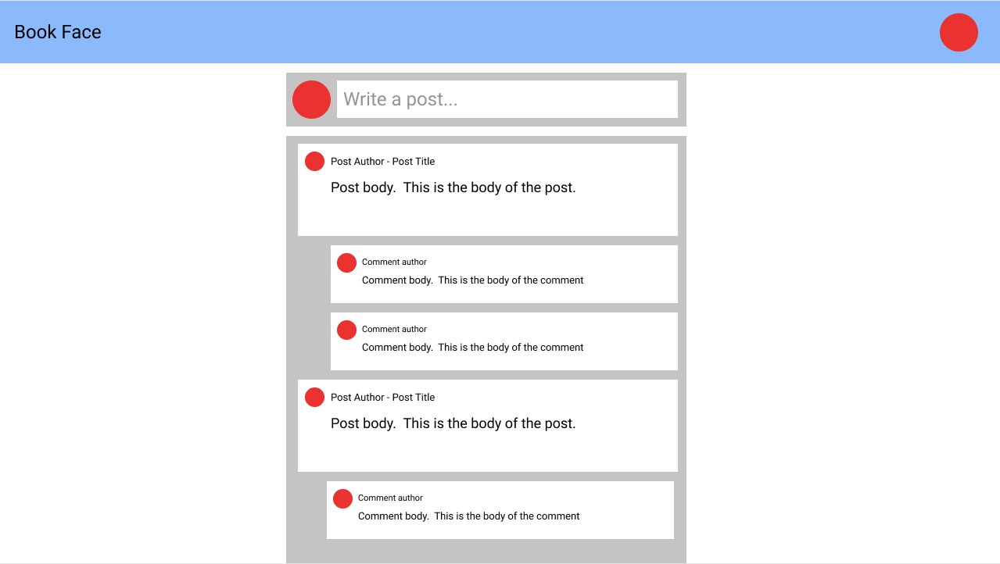
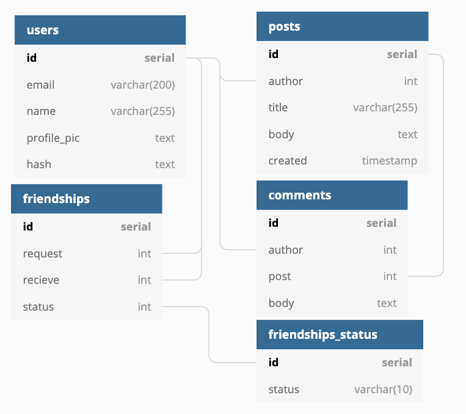

# Planning

When planning an application, it's important to keep in mind the user experience above all. Use that to inform all of your other decisions. Here we will go through the process of planning a single feature: a social media timeline. This will guide us through planning each of the necessary pieces of our plan including:

- Target user/familiarity with tech
  - Who will be using your site?
  - What is their expected familiarity with technology (how simple does your ui need to be?)
- Features: What can the user do?
  - These can be formatted as "As a user I can...."
- Wireframes
  - Low-res mockup of the layout of your site
- Components (optional)
  - How many components will you need to accomplish this?
  - What will be their state, props, and methods?
- Schema
  - How will your database be structured?
  - How many tables will you need?
  - Foreign keys?
- Endpoints
  - What data will you need to interact with?
  - How will you need to interact with this data?
- Controllers

Now we'll walk through planning our feature: a social media timeline. You will need to use this process to plan each of the features on your personal project, combining all of them will give you your complete plan.

## Target user/familiarity with tech

Our site is expected to be used by the general public. For this reason, we can expect a very limited level of experience. Our ui should be as simple/intuitive as possible

## Features

1. As a user I can view all of my and my friends posts
2. As a user I can create a new post
3. As a user I can comment on a post

## Wireframes

This is a low-res mockup of what the ui will look like. When the user shows up to your site, what do they see?



## Schema

In order to allow the user to use the listed features, what data will I need? Just with these 3 simple features we know several things about the data:

1. We will need a users table (what information do we want to collect from our users?)
2. We will need a posts table (We will need to know which user made each post). Each post will have a title and a body.
3. We will need a comments table (We will need to know which post the comment belongs to and who made the comment). Each comment will only have a body.
4. We will need some way to determine if any two users are friends. This will allow us to determine if a user should see another user's post.
5. Because we don't want to allow a user to see someone's post without their consent, we will need a way to determine the status of the friendship (requested, accepted, rejected?)
6. You can see how this will quickly cascade into planning other features. Do your best to do one at a time.



## Endpoints

You should use your list of features to inform what endpoints you need. Each way that the user will interact with your site will likely need an endpoint. Let's look at ours

As yourself the following questions:

1. What data am I interacting with?
2. How am I interacting with this data? Think of CRUD, which of these are you using?
3. Will any specific information be needed to complete this interaction? The answer to this question will inform your queries, params, and body
4. Am I expecting anything back? How am I expecting the data to be formatted?

Let's look at these questions for each of our features:

### "As a user I can view all of my posts and my friends' posts"

1. What data am I interacting with?

My timeline, including my posts and my friend's posts. This timeline will be unique to me so we should use me as an entry point to get it.

`/api/users/:user_id/timeline`

2. How am I interacting with this data

I am reading the data, getting my timeline.

`app.get`

3. Will any specific information be needed to complete this interaction?

My user id

I can combine this info to get my endpoint:

`app.get('/api/users/:user_id/timeline))`

4. Am I expecting anything back? How should the data be formatted?:

```js
const timeline = [
  {
    post_id: number,
    title: string,
    body: string,
    author: {
      user_id: number,
      name: string,
      profile_pic: string,
    },
    comments: [
      {
        comment_id: number,
        body: text,
        author: {
          user_id: number,
          name: string,
          profile_pic: string,
        },
      },
    ],
  },
]
```

### "As a user I can create a new post"

1. What data am I interacting with?

Posts.

`/api/posts`

1. How am I interacting with this data

I am creating new data, a new post

`app.post`

3. Will any specific information be needed to complete this interaction?

My id: the post author
Title: the post title
Body: the post body

I can combine this info to get my endpoint:

`app.post('/api/posts', body: {id: number, title: string, body: string}))`

4. Am I expecting anything back? How should the data be formatted?

I should just refresh my timeline when the post is successful.

### "As a user I can add a comment to a post"

1. What data am I interacting with?

Comments on a specific post. Because the comments will be unique to that post, it should be used as an entry point

`/api/posts/:post_id/comments`

1. How am I interacting with this data

I am creating new data, a new comment

`app.post`

3. Will any specific information be needed to complete this interaction?

My id: the comment author
Body: the comment body
post id: the id of the post I am commenting on

I can combine this info to get my endpoint:

`app.post('/api/posts/:post_id', body: {user_id: number, body: string}))`

1. Am I expecting anything back? How should the data be formatted?

I should just refresh my timeline when the comment is successful.

## Controllers

Looking at my endpoints/schema. How many controllers will I need and which functions should they contain? If you are unsure, look at how many resource groups you are interacting with. For us that is:

1. Users
   1. getTimeline
2. Posts
   1. createPost
3. Comments
   1. createComment
